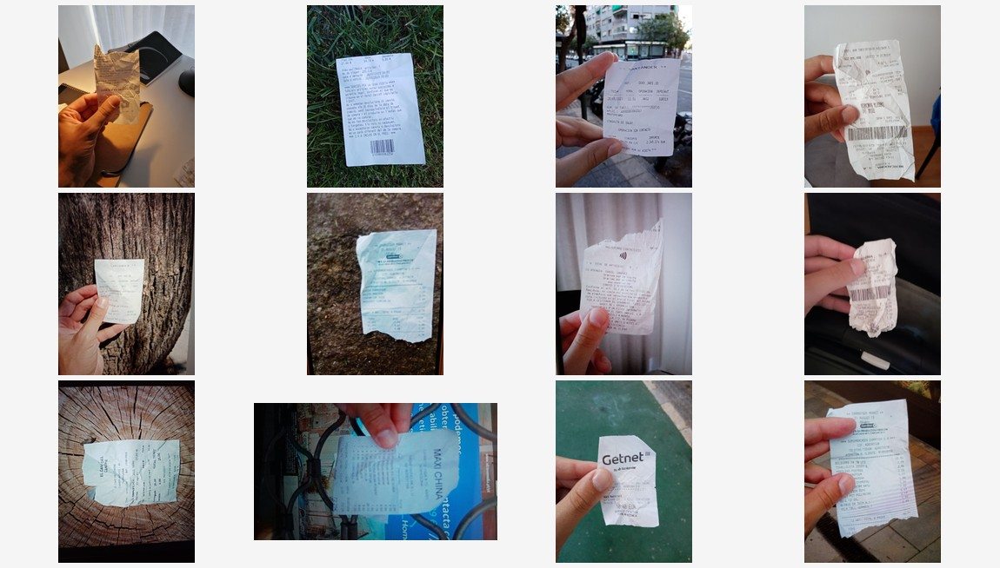
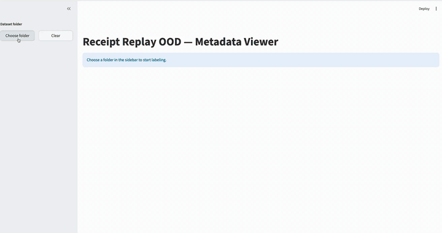

# Receipt Replay OOD

A small out-of-domain benchmark for screen replay detection under domain shift.

## Overview

Receipt Replay OOD is a compact benchmark dataset for evaluating cross-domain robustness of document replay attack detection systems.

The dataset contains:
- bona fide receipt captures
- replay attack samples
- receipt localization annotations
- metadata for acquisition conditions

<!-- dataset-preview-start -->

<!-- dataset-preview-end -->

## Dataset statistics

| Category | Count |
|----------|------:|
| Bona fide | 497 |
| Replay attacks | 804 |
| Mobile devices | 3 |
| Laptops | 3 |

## Dataset folder structure

```
data/
├── LIVE/
│   ├── Honor 8A/
│   ├── Huawei P30 Lite/
│   └── Samsung Galaxy J3/
├── REPLAY/
│   ├── Honor 8A by Samsung Galaxy J3/
│   ├── Huawei P30 Lite by Honor 8A/
│   ├── Lenovo ThinkBook 15 G2 by Honor 8A/
│   ├── Phillips PHL 271V8 and MacBook Pro M1/
│   └── Samsung Galaxy J3 by Honor 8A/
└── metadata.csv
```

## Metadata description

Metadata fields:

- `path`
- `environment` (`indoor` / `outdoor`)
- `fingers_presence` (`fingers` / `without_fingers`)
- `box` (receipt polygon coordinates)

## Motivation

Existing document anti-spoofing datasets mainly focus on identity documents. Receipt Replay OOD introduces receipt-based replay attacks as a lightweight and privacy-safe OOD benchmark.

## Publication

[Receipt Replay OOD (arXiv)](https://arxiv.org/pdf/2605.26855)

## Metadata labeling tool

A small Streamlit app (same folder-browser pattern as `fraud_trend_viewer`) lives in `metadata_viewer/`:

```bash
cd metadata_viewer
python3 -m venv .venv && source .venv/bin/activate
pip install -r requirements.txt
streamlit run app.py
```

Requires **Python 3.10+** — do not use macOS `python` (often 3.7).

Run from the repo root if you prefer: `streamlit run metadata_viewer/app.py`

1. **Choose folder** — recursively indexes all images under the dataset root.
2. Creates or updates **`metadata.csv`** in that folder with columns: `path`, `box`, `environment`, `fingers_presence`.
3. **← / →** buttons or keyboard arrows to move between images.
4. Draw a **polygon** on the receipt and **Save polygon** (stored as JSON in `box`).
5. Set **indoor** / **outdoor** and **fingers** / **without_fingers**, then save.

Paths in the CSV are relative to the chosen dataset root (e.g. `LIVE/Honor 8A/live_0001.jpeg`).

## How it works



## Citation

If you use Receipt Replay OOD in your research, please cite:

```bibtex
@misc{vinogradov2026receiptreplayoodsmall,
      title={Receipt Replay OOD: A Small Benchmark for Screen Replay Detection Under Domain Shift},
      author={Alexander Vinogradov},
      year={2026},
      eprint={2605.26855},
      archivePrefix={arXiv},
      primaryClass={cs.CV},
      url={https://arxiv.org/abs/2605.26855},
}
```
